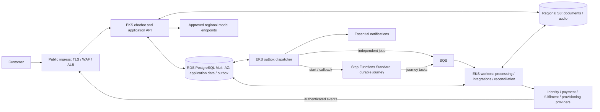
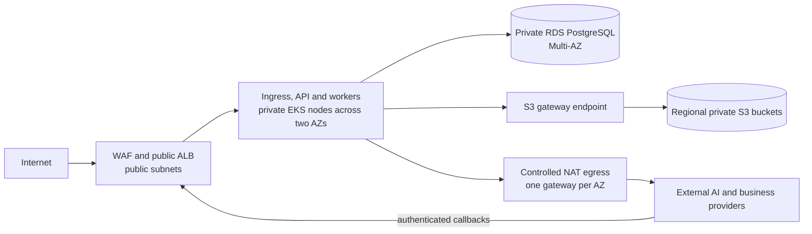

# Meridian Telecom - Solution

## 1. Design drivers and assumptions

### Requirements and constraints

- **Customer journey:** conversations and progress survive disconnections, restarts and deployments, including waits lasting weeks and manual review. Customers receive timely responses and updates; retries must not cause duplicate charges or shipments, or activation before required checks pass.
- **Reliability and security:** 99.9% availability; conversation and durable workflow state RPO < 1 minute and RTO < 10 minutes; confidential data remains in the selected region; agent runs and external actions are auditable.
- **Platform:** AWS and managed Kubernetes, operated by two Platform Engineers alongside AI Engineers. Use managed services where their operational benefit justifies lock-in; make infrastructure costs measurable.
- **Scale:** approximately 100 launch users, with a path to 100,000 users, thousands of concurrent sessions and hundreds of thousands of daily background tasks. Mostly I/O-bound work, some CPU-heavy processing, optional company-managed GPUs and existing external integrations.

### Working assumptions and confirmations

| Topic | Working position | Confirmation needed |
|---|---|---|
| Recovery and availability | Design for pod/node, primary database and single-AZ failures; measure availability monthly. | Agree success/latency criteria and failure scope. Logical corruption and regional outages are not demonstrated to meet the recovery targets. |
| Residency and providers | Launch with approved regional model endpoints and no dedicated GPUs. | Select region and confirm residency across integrations, inference, telemetry, backups and provider access. Verify idempotency and its retention window, status lookup, callback authentication and correlation contracts. |
| Product and operations | Authenticate before accessing a personal journey; use essential notifications and manual exception handling. | Select IdP and notification channel; agree retention/deletion, reviewer ownership, response times and on-call coverage. |
| Delivery and capacity | Accounts and sandboxes are available; growth is gradual with bursts; AI development proceeds alongside Platform. | Confirm team availability, traffic shape, job duration, model mix, latency expectations and budget. |

These assumptions do not relax the requirements. Missing provider guarantees can prevent safe automation; unresolved residency or recovery requirements block launch.

## 2. Architecture and key decisions



### Network view



The launch VPC spans two Availability Zones. Only the ALB and NAT gateways use public subnets; EKS nodes and RDS have no public addresses. Security groups restrict the ALB-to-application and application-to-database paths. An S3 gateway endpoint keeps object traffic off the NAT path without an hourly endpoint charge. NAT provides zonal outbound connectivity rather than destination filtering, so workload identity, application allow-lists and provider controls remain necessary. Each AZ uses its local NAT path so the loss of one AZ does not remove provider connectivity. [S3 gateway endpoints](https://docs.aws.amazon.com/vpc/latest/privatelink/gateway-endpoints.html), [NAT gateway pricing and topology](https://docs.aws.amazon.com/vpc/latest/userguide/nat-gateway-pricing.html)

### Components and responsibilities

EKS runs three application workloads: the chatbot/API, the outbox dispatcher and the workers. The database, workflow engine, queues and object storage are managed AWS services outside the cluster. The components in the architecture diagram connect as follows:

| Component | Role and connections |
|---|---|
| Public ingress: TLS, WAF and ALB | Protects and routes customer requests and provider webhooks to the API, which authenticates callers and authorizes access. |
| Chatbot and application API on EKS | Handles conversations, customer commands and status reads. Calls regional model endpoints, reads/writes PostgreSQL and authorizes customer document/audio transfers to S3. |
| RDS PostgreSQL Multi-AZ | Stores conversations, business facts, operation records, received provider events and the customer-facing status summary. Its outbox table records pending deliveries alongside application changes. |
| Outbox dispatcher on EKS | Reads pending deliveries from PostgreSQL and sends workflow starts/callbacks to Step Functions, independent jobs to SQS and notifications to the selected channel. |
| Step Functions Standard | Coordinates the durable journey: execution position, transitions, timers and waits. Submits journey tasks to SQS and resumes eligible waits on callbacks delivered by the dispatcher. |
| SQS | Buffers tasks from Step Functions or the dispatcher for workers to consume. Absorbs bursts and allows background processing to scale independently of chat; redelivery requires safe duplicate handling. |
| Workers on EKS | Perform processing and external integrations; read/write PostgreSQL and S3. Reconcile provider evidence, update customer status and record pending workflow callbacks in the outbox. |
| Regional S3 | Holds documents/audio accessed through authorized customer transfers or by workers for processing. PostgreSQL stores object ownership and metadata. |
| Approved regional model endpoints | Return inference results to the chatbot/API. Application logic validates proposed actions before accepting commands into the durable journey. |
| Identity, payment, fulfilment and provisioning providers | Perform external actions requested by workers. Delayed results return as authenticated webhooks through ingress to the API; workers use provider status lookup for reconciliation where supported. |
| Essential notifications | The dispatcher sends required-action and milestone messages through the agreed channel, linking customers back to the authenticated private area. |

**How the components cooperate:** the API saves a customer command and its pending workflow start; the dispatcher starts Step Functions; the workflow queues a task; a worker executes it and saves the result with any pending callback; the dispatcher delivers that callback so the workflow can continue. For delayed provider results, the API durably captures the webhook and workers reconcile it with the operation before scheduling the callback. The chatbot reads persisted progress when the customer returns.

**Why the outbox exists.** The outbox is a PostgreSQL table containing requests to send to other systems: the application's “outgoing mail”. Without it, the API could save a purchase and crash before starting its workflow, leaving an accepted purchase with no processing started.

**Who manages it.** RDS manages the database infrastructure, configured backups and Multi-AZ failover; PostgreSQL provides transactional persistence. The outbox is an ordinary application table, not an AWS delivery service: RDS does not read its entries and start workflows automatically. Application code writes the entries, and the dispatcher on EKS implements delivery, retries and delivery-status updates.

Dispatcher replicas coordinate through atomic claims recorded in PostgreSQL. Each claim expires so another replica can recover an entry if its owner crashes. Remote calls happen outside the claiming transaction; expiry or uncertain delivery can still lead to duplicate attempts, so idempotency remains necessary.

For example, when the customer confirms purchase `purchase-123`:

1. The API saves the purchase and an outbox entry saying “start the workflow for purchase-123” in the same database transaction. Either both are saved or neither is; the API confirms acceptance only after the commit. Conversation turns are also persisted before receipt is confirmed.
2. A small replicated dispatcher process on EKS periodically reads pending outbox entries, sends the start request to Step Functions and marks the entry as delivered after confirmed delivery. If the API crashes after the commit, the request remains available to the dispatcher; failed deliveries can be retried.
3. If the dispatcher sends the request but crashes before marking it as delivered, it may send it again. A stable execution identity and reconciliation with the original execution prevent that retry from starting a second purchase workflow.

The outbox prevents loss of accepted work between a database commit and a remote call; it does not eliminate duplicate delivery. Stable identifiers and idempotent handling remain necessary. The same pattern delivers workflow callbacks, independent jobs and notifications, at the cost of polling latency and recovery logic. [Transactional outbox](https://docs.aws.amazon.com/prescriptive-guidance/latest/cloud-design-patterns/transactional-outbox.html)

Step Functions submits journey tasks to SQS; the API does not also submit those tasks. Workers handle integrations and CPU-heavy processing independently of interactive traffic. Business waits live in the workflow, without occupying a worker or leaving a queue message unacknowledged for days. Only tasks that gate progress need workflow callbacks. [Callback integrations](https://docs.aws.amazon.com/step-functions/latest/dg/connect-to-resource.html)

Distinguish a received message from a completed model response, and recover interrupted turns. Status access remains available without inference; a pending acknowledgement does not count as a completed conversational answer. Notifications contain minimal information and link to the private area.

Use private encrypted S3 storage, authorized short-lived transfers, upload validation and a fixed validated object version. Apply retention and cleanup to abandoned uploads and old versions. Queues and workflow payloads carry references rather than customer content.

### Four choices to defend

| Choice | Why this option | Alternative and trade-off | Revisit when |
|---|---|---|---|
| Step Functions Standard | Managed durable waits, timers and resumptions. | A PostgreSQL workflow adds recovery/timer tooling to maintain; Temporal is credible for stronger workflow programming needs. Step Functions adds AWS-specific definitions and transition costs. | Expressiveness, portability or measured costs outweigh the managed-service benefit. |
| PostgreSQL with outbox and status summary | One transactional application store supports resumption, operation records and efficient reads. | Reading execution history per request couples customer access to orchestration APIs; another read store adds synchronization. The summary can lag and needs repair. | Query/index/connection tuning no longer resolves measured database pressure. |
| SQS and EKS workers | Buffer bursts and scale background work separately from chat. | Doing work inside requests ties responsiveness to provider latency; orchestration for every independent job adds unnecessary coordination. Queues require duplicate handling and backpressure. | Measured contention or priority differences justify separating worker pools or queues. |
| Managed services and resilient baseline | EKS, RDS Multi-AZ and managed telemetry reduce operations for a small team. | Self-hosting offers control but adds maintenance; Single-AZ lowers cost but weakens the recovery approach. The chosen baseline has a material minimum cost and AWS dependency. | Measured economics or operational requirements justify a different arrangement. |

Standard workflow execution does not by itself guarantee exactly-once effects at a payment or shipment provider. Application and provider contracts remain necessary. [Workflow types](https://docs.aws.amazon.com/step-functions/latest/dg/choosing-workflow-type.html)

### Three application contracts

1. **State ownership:** Step Functions owns execution position, waits and transitions. PostgreSQL owns conversations, business facts and operation records; providers supply authoritative evidence of external effects. The summary is a derived view, never authorization for an action. Persist enough business history to reconstruct customer status independently of workflow-history retention; use execution state to reconcile orchestration progress.
2. **Operation identity:** repeated requests for the same purchase reuse the same intended payment or shipment, even across sessions. Atomically check prerequisites and authorize an operation with fixed input/version before external submission. Changes after submission require an explicit correction or assistance path. Deterministic application checks enforce eligibility and customer confirmation; neither the model nor a duplicate message can authorize activation.
3. **Recovery:** durably capture and deduplicate incoming events before acknowledging them, including events arriving before their wait registration. Reconciliation matches evidence to operations and eligible waits, repairs summaries and schedules callbacks; late or duplicate events cannot regress confirmed progress. An unknown outcome remains pending until resolved; unresolved uncertainty goes to manual review, without a new charge or shipment.

Platform owns infrastructure, IAM/networking, delivery, recovery tooling, telemetry, capacity and infrastructure spend. AI Engineers own conversation, workflow and integration logic, including reconciliation running in the existing workers; Platform provides its scheduled execution and monitoring. Both agree operation contracts, compatibility and incident handoffs. Business reviewers own customer exceptions; that role must be assigned before launch.

## 3. Worked example: a payment survives a crash

This example shows **how to recover a successful payment when the worker crashes before recording the outcome**, without charging the customer twice.

Assume identity verification has passed and the provider supports an **idempotency key**: repeating the same request with that key must not create another payment. Authoritative status lookup and authenticated webhooks carrying the operation reference are also assumed. These capabilities must be confirmed: this is a design walkthrough, not a test result.

1. **The customer confirms the purchase.**  
   The API saves the confirmation, payment operation identifier and an outbox entry to start the workflow in one PostgreSQL transaction. Only then does it confirm that the request has been accepted.

2. **Payment processing starts.**  
   The dispatcher reads the outbox and starts Step Functions. The workflow puts the task in SQS and waits. A worker picks up the task, checks prerequisites, saves the payment intent and calls the provider with the idempotency key.

3. **The provider charges the customer, but the worker crashes.**  
   The charge has happened, but the worker cannot save the outcome in PostgreSQL. From the platform's perspective, the result is **uncertain**, so the status remains “payment confirmation pending”.

4. **The provider's notification arrives.**  
   The provider sends a webhook confirming payment. The API authenticates it and saves it in the database before responding. Even if the link to the workflow wait is not yet complete, the notification is preserved.

5. **The customer returns to the chat.**  
   The API retrieves the purchase and status from the database. The customer resumes the same journey; another confirmation does not create a second payment operation.

6. **A worker recovers the task.**  
   The message was not deleted from SQS, so it can be delivered again. The worker identifies the same operation, restores its link to the workflow wait and checks the stored webhook or queries the provider. Once success is established, it saves the outcome, customer status and an outbox entry to resume the workflow together. It then deletes the SQS message.

7. **The journey resumes.**  
   The dispatcher delivers the callback to the eligible Step Functions wait, allowing the workflow to proceed toward shipment. If the callback needs a retry, it retries **delivery of the outcome**, without executing the payment again.

The central point is that **a crash does not mean a payment failed**: before acting again, the system reconstructs what happened using the stable operation identifier and provider evidence. If it cannot establish the outcome, the case goes to manual review.

A task token identifies a particular wait, not the payment: an expired token does not establish the outcome or authorize advancing a closed or diverted journey. If a later step fails after a charge or shipment, refunds or cancellations are handled manually at launch, recorded and communicated. This avoids a generic compensation engine, at the cost of reviewer effort and slower exceptional resolution.

## 4. Reliability, security and operation

### Reliability and recovery

- **Survive a zone failure:** distribute replicas and node capacity across two AZs, with RDS Multi-AZ and client reconnection; retain enough capacity and outbound connectivity for chat and status in the surviving zone, accepting extra baseline cost and temporarily slower background processing. [RDS failover](https://docs.aws.amazon.com/AmazonRDS/latest/UserGuide/Concepts.MultiAZ.Failover.html)
- **Prove recovery:** test state loss and time to restore usable conversations, status and pending work against RPO < 1 minute and RTO < 10 minutes; Multi-AZ and backups alone do not prove these targets. Logical corruption and regional outages remain outside the assumed scope, pending confirmation; recovery must respect data residency.
- **Deploy safely:** pin workflow versions and keep database changes and workers compatible with open journeys; rolling back new starts does not undo running executions.

As Chapter 3 illustrates, the dispatcher retries delivery, workers retry transient calls within bounds, and workflows manage business waits; backoff, provider concurrency limits, reviewed dead-letter replay and reserved callback capacity prevent retries or notification failures from blocking progress.

### Security and audit

- **Control access and exposure:** authenticate customers, operators and provider events; enforce ownership and least privilege, including background work. Combine private workloads, TLS/WAF, request limits and encrypted, rotated secrets.
- **Constrain AI and data use:** application code validates actions and approvals independently of the model; treat external content as untrusted, bound usage and restrict data flows to approved regional destinations, including providers, telemetry and backups.
- **Preserve accountability:** retain unsampled audit records of agent runs, model versions, approvals, operation intents, provider outcomes and operator actions, protected from ordinary application changes. Redact personal data and tokens from telemetry; agree retention and deletion rules.

### Daily operation

Use regional managed logs, metrics and OpenTelemetry traces correlated by journey/operation ID, with ingestion and retention controls. Measure the 99.9% availability objective through chat, durable acceptance and status access, with agreed latency/success criteria and provider impact. Separately monitor stalled jobs, queue/outbox age, uncertain outcomes, provider throttling, database pressure and cost: legitimate business waits are not downtime.

An authenticated operator view supports reviewed, audited interventions. Platform owns infrastructure incidents, AI Engineers workflow/integration defects, and business reviewers customer exceptions. Alerts need runbooks and agreed escalation: **two Platform Engineers do not imply 24/7 coverage**.

## 5. Growth and cost

### Launch and growth

At launch, workloads share EKS nodes to contain costs, with resource requests and limits protecting chat from heavy jobs. Keep the dispatcher small and replicated; defer Redis and dedicated GPUs.

Scale capacity according to actual work:

- **Chat:** replicas follow active requests.
- **Workers:** replicas follow backlog, job duration and desired drain time.
- **Nodes:** Managed Node Groups with Cluster Autoscaler add capacity; SQS absorbs bursts while capacity starts. HPA needs a metrics adapter or KEDA for application signals.

Bound replicas, database connections and aggregate provider calls: more workers cannot overcome external quotas. Preserve chat headroom, scale down conservatively and request quota increases before reaching limits.

Load tests use representative durations and bursts, not user count alone. Tune database access before adding caches; CPU isolation, dedicated GPUs or orchestration changes require concrete needs or measured benefits. AI owns model selection, routing and consumption; Platform owns infrastructure and capacity.

### Initial cost estimate

**Ireland (`eu-west-1`): approximately €600–710/month; allow €700–850/month for launch budgeting.** Public AWS prices checked on 18 September 2026 for one production environment, 730 hours/month, on-demand Linux nodes, standard EKS/PostgreSQL support and no Auto Mode. No credits, free-tier deductions or commitments are assumed. Conversion uses [ECB reference rate, 18 September 2026](https://www.ecb.europa.eu/stats/policy_and_exchange_rates/euro_reference_exchange_rates/html/index.en.html): EUR 1 = USD 1.1460; AWS billing conversion may differ. Other European regions require their own calculation.

| Cost area | Pricing basis and explicit launch assumption | Monthly EUR, rounded |
|---|---|---:|
| EKS control plane | $0.10/hour × 730 = $73. | €64 |
| EKS nodes and disks | Two `m6i.large` (2 vCPU / 8 GiB), one per AZ: 2 × $0.107/hour × 730; two 30 GB gp3 disks at $0.088/GB-month. Total $161.50. | €141 |
| RDS PostgreSQL | `db.m6g.large` Multi-AZ **including one standby**: $0.352/hour × 730 + 50 GB gp3 × $0.254/GB-month = $269.66. No extra IOPS; backups within the included allowance. | €235 |
| Ingress and networking | Two NAT gateways ($0.048/hour each), ALB ($0.0252/hour), four public IPv4 addresses ($0.005/hour each), basic WAF (one ACL, five rules, 1M requests). Illustrative 0.1–1 average LCU and 100 GB through NAT; allowance for modest additional transfer. | €105–125 |
| Telemetry | **Usage allowance:** 10–30 GB/month of standard logs ($0.57/GB ingestion), 30-day retention, 50–200 custom metrics ($0.30/metric-month), ten standard alarms and limited queries/sampled tracing. | €30–90 |
| Step Functions Standard | Illustrative 10,000–100,000 transitions × $0.000025, before free-tier deductions. | €0.22–2.18 |
| Other managed services | **Budget allowance**, not a fixed tariff: low use of S3, SQS, ECR, Secrets Manager, KMS, DNS and additional backup storage; volumes remain unconfirmed. | €20–50 |

The rounded rows total approximately **€595–707/month**. The €700–850 budget adds contingency for usage and exchange-rate variation; it is not a spending cap. Compared with the previous €700–1,200 estimate, the main corrections are explicit instance prices and replacing USD/EUR parity with the reference exchange rate. Telemetry and other-service allowances remain estimates, not a validated bill.

This excludes VAT, paid AWS support, non-production environments, CI runner costs, customer identity/notification services, AI models and business-provider fees. Two nodes are a sizing assumption: load and AZ-failure tests may require more capacity. One additional node of the same type with a 30 GB disk adds about €70/month. Cheaper pricing does not demonstrate the recovery targets.

Verified pricing sources: [EKS](https://aws.amazon.com/eks/pricing/), [EC2/EBS/NAT eu-west-1](https://pricing.us-east-1.amazonaws.com/offers/v1.0/aws/AmazonEC2/current/eu-west-1/index.csv), [RDS eu-west-1](https://pricing.us-east-1.amazonaws.com/offers/v1.0/aws/AmazonRDS/current/eu-west-1/index.json), [ALB eu-west-1](https://pricing.us-east-1.amazonaws.com/offers/v1.0/aws/AWSELB/current/eu-west-1/index.json), [IPv4](https://aws.amazon.com/vpc/pricing/), [WAF](https://aws.amazon.com/waf/pricing/), [CloudWatch eu-west-1](https://pricing.us-east-1.amazonaws.com/offers/v1.0/aws/AmazonCloudWatch/current/eu-west-1/index.json), [Step Functions eu-west-1](https://pricing.us-east-1.amazonaws.com/offers/v1.0/aws/AmazonStates/current/eu-west-1/index.json).

### Cost measurement and control

Separate the **fixed baseline** (cluster, initial nodes, database, networking and telemetry) from **variable usage** (additional capacity, processing, storage, transitions, messages, logs and traffic). Track infrastructure and model consumption separately, reporting their combined cost per completed journey, including retries and abandonment.

Attribute spend by environment/component, set budget alerts and enforce usage/concurrency limits. Replace assumptions with measured workload scenarios before budget approval; assess any cheaper baseline against recovery capacity and operational effort.

## 6. Delivery, validation and AI usage

### Development and delivery

Use reviewed Terraform with **remote S3 state shared by the two Platform Engineers**, encryption and locking; isolate access by environment. CI checks infrastructure, application and workflows, with synthetic sandbox tests and controlled rollout/rollback. Platform and AI build one complete journey early and exercise its failure points.

**Indicative delivery plan: 12 weeks in three phases for an agreed first-release scope**, assuming two dedicated Platform Engineers, parallel AI-team delivery, and available accounts, external provider test environments, credentials and agreed integration contracts. This is a planning estimate, not a validated delivery commitment.

| Phase | Main activities | Expected outcome |
|---|---|---|
| **Weeks 1–2 — Foundations** | Confirm region, recovery scope, provider guarantees and operational ownership. Provision infrastructure with Terraform, access controls, secrets, CI and baseline telemetry. | Environment ready for integration; critical dependencies confirmed. |
| **Weeks 3–6 — Complete journey** | Integrate the first durable journey with AI Engineers, including reconciliation, resume/status, notifications and manual-review handoff. Start joint failure testing. | End-to-end journey demonstrated in provider test environments, including resume and safe handling of retries and duplicate events. |
| **Weeks 7–12 — Launch readiness** | Validate load, recovery targets (RPO < 1 minute, RTO < 10 minutes), data residency and deployment compatibility. Fix issues and repeat failed checks; tune capacity/cost. Finalize runbooks, rehearse recovery and escalation, agree incident ownership and roll out gradually after approval. | Correctness, residency and recovery checks passed; initial rollout monitored with rollback procedures ready. |

The final phase includes time for corrections and repeated validation, not just executing tests. Launch remains conditional on passing the readiness checks; missing provider guarantees, scope changes or unresolved failures require revising the plan, even beyond week 12.

After launch, incidents, stalled journeys, latency and unit costs guide priorities and capacity increases.

### Validation priorities

| Area | Evidence required before launch |
|---|---|
| Journey continuity | Disconnects, restarts and long waits preserve conversation and pending actions; interrupted responses recover and absent customers receive essential updates. |
| Safe external actions | Exercise the worked example, concurrent confirmations, duplicate/early/late events, lost callbacks and provider outages. Provider records show no duplicate charge/shipment; unmet prerequisites prevent activation; unresolved cases reach review. |
| Deployment compatibility | An old waiting journey resumes across workflow, worker and schema updates, including rollback. |
| Recovery | Inject pod/node/AZ/database failures and measure customer-visible recovery and state loss against the targets. Rehearse backup restore separately. |
| Security and sustainable load | Demonstrate customer/operator isolation, upload controls, regional data paths, secret protection and auditable actions. Mixed chat/CPU load respects latency, provider limits, capacity and cost expectations; verify alert ownership. |

These are planned tests, not results. Correctness, residency and recovery failures block launch.

### AI usage

- **Tools and delegated work:** Codex with GPT-5.6 Terra and GPT-6 Astra for planning, critical review of requirements and alternatives, drafting and consolidation, failure scenarios and cost verification. Planning steps were followed by implementation after critical review and validation of the proposed solution against the requirements.
- **Reviewed choices:** accepted outbox delivery, managed orchestration, explicit recovery assumptions and a resilient baseline. Auto Mode was not selected; GPUs, Redis and alternative orchestration were deferred. Detailed SQL/locking/scheduling was removed and dense explanations were replaced with a step-by-step payment example.
- **Roadmap review:** Codex helped clarify delivery dependencies and launch criteria; the author selected a three-phase, 12-week plan with time for fixes, repeated checks and gradual rollout. The English and Italian roadmap text was checked for consistency; the estimate remains unvalidated.
- **Checks and limitations:** assignment coverage and architecture/example consistency were reviewed with reference to official documentation. AWS Ireland pricing was assessed by distinguishing tariffs and usage assumptions for fixed and variable costs. No deployment, provider experiment or runtime test was performed: operational guarantees remain to be demonstrated.

The repository separates instructions, requirements and the proposal so AI suggestions are not treated as requirements:

```text
AGENTS.md        AI working rules and review criteria
assignment.md    Authoritative requirements; unchanged
solution.md      Proposal, assumptions, decisions and validation gaps
solution_ita.md  Italian version of the proposal
```
