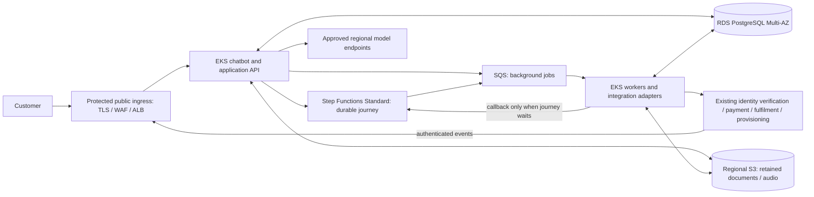

# Meridian Telecom - Solution

## 1. Requirements and constraints

- **Explicit requirements:** a resumable customer journey lasting days or weeks, durable conversations and pending actions, including manual review; no duplicate charges or SIM shipments, and no activation before required checks pass. Chatbot responsiveness must not depend on completion of background work.
- **Explicit reliability and security targets:** 99.9% availability; conversation and durable workflow state RPO < 1 minute and RTO < 10 minutes; confidential customer data stays in the selected region; agent runs and external actions are traceable and auditable.
- **Constraints:** AWS, managed Kubernetes for first production, public internet exposure, two Platform Engineers alongside AI Engineers. Prefer managed services where their benefit justifies lock-in; infrastructure costs must be measurable and sustainable.
- **Workload context:** around 100 launch users, growing toward 100,000 users, thousands of concurrent sessions and hundreds of thousands of daily background tasks. Mostly I/O-bound, with some CPU-heavy processing; company-managed GPUs are optional. Identity verification, payment, fulfilment and provisioning already exist as integrations.

## 2. Assumptions and open questions

### Assumptions

- AWS accounts and provider sandboxes are available; platform infrastructure must be built.
- Recovery targets initially apply to failures within the selected region. This interpretation needs confirmation; a regional outage strategy must also respect regional residency and is not solved by silently copying data elsewhere.
- The scope and measurement window of 99.9% need agreement. Measure the customer experience end to end, including provider impact, even when platform and provider indicators are reported separately.
- Customers may explore offers anonymously but authenticate before accessing a personal journey. This is a product assumption, not an assignment requirement.

### Open questions

- Which region, provider endpoints and contracts satisfy residency, including inference, logs, backups, support access and subprocessors? A non-compliant dependency blocks launch.
- Do providers support stable idempotency keys, sufficiently long deduplication windows, status lookup and authenticated callbacks? Missing guarantees materially affect safe automation.
- Which Identity Provider handles customer and operator authentication? This is distinct from the existing identity-verification provider.
- Who owns manual review and customer support, with what response times, escalation and operational coverage? Two Platform Engineers do not imply continuous on-call coverage.
- What traffic shape, latency targets, model mix, retention, document/audio volumes, region and budget should drive sizing and cost estimates?
- Do recovery targets include logical corruption and regional service outages? Backup restoration alone has not been shown to meet them. Audit retention and deletion obligations also need agreement.

## 3. Proposed architecture

### High-level design

Decisions below are carried forward from the supplied consolidation plan. Explicit proposals awaiting confirmation are labelled separately.

The API persists conversation updates and accepted commands, then returns a durable reference and current status without waiting for heavy work. Acceptance must have the recovery semantics in section 5; starting a workflow is not atomic with a database commit. User inputs and verified provider events are correlated to the waiting journey through the application integration layer. The chatbot reads a persisted summary, including pending actions and freshness, rather than reconstructing execution history for every request.

### Main components and responsibilities

- **Step Functions Standard** owns workflow execution, timers, waits and transitions. Only work that gates the journey requires a callback; independent document/audio processing can complete as an ordinary queued job.
- **EKS** runs the application and separately scalable workers. SQS absorbs bursts; it is not the store for weeks-long business waits. Messages carry references rather than confidential payloads where possible.
- **RDS PostgreSQL Multi-AZ** stores conversations, application data, operation identities/results and the queryable journey summary. The summary may lag and must be repairable from execution and operation records. It is not a second workflow engine and cannot authorize an external action on its own.
- **Regional S3**, if files are retained, stores encrypted documents/audio with controlled access and retention. Workflow inputs and histories contain minimal references, not entire conversations or documents.
- **Existing providers** determine whether an external action actually succeeded. A local timeout or a workflow transition cannot establish that fact. The application reconciles provider evidence before advancing.

### Platform vs AI ownership boundary

Platform owns infrastructure, IAM/networking, delivery foundations, recovery tooling, telemetry, capacity and infrastructure cost. AI Engineers own conversational behaviour, workflow definitions, integration/business logic, deterministic action checks, model selection and model cost. Both teams agree operation/idempotency contracts, compatibility and incident handoffs, and validate the first journey end to end. Business ownership of manual review remains unresolved; it must not default silently to Platform.

## 4. Key design decisions and trade-offs

| Decision | Problem and selected option | Credible alternative | Cost / trade-off and revisit trigger |
|---|---|---|---|
| Durable orchestration | Step Functions Standard handles waits and resumptions without keeping a pod alive. | A custom PostgreSQL workflow is initially familiar but adds timers, recovery and tooling to maintain. Temporal is credible where workflow programming requirements justify another platform dependency. | AWS-specific definitions, service quotas, transition charges and application compatibility remain. Revisit if measured cost, workflow expressiveness or portability needs outweigh managed-service benefits; no planned Temporal migration. |
| Separate jobs from orchestration | SQS and EKS workers isolate CPU-heavy/high-volume jobs from interactive requests; callbacks only for journey dependencies. | Execute everything as workflow tasks, or let queue consumers coordinate the entire journey. | Queue redelivery, backpressure and callback recovery add work, but avoid per-job orchestration where unnecessary. Revisit queue boundaries based on contention and priority, not predicted final scale. |
| PostgreSQL plus persisted summary | One transactional application store supports resumption, operation deduplication and efficient status reads; no Redis at launch. | Read workflow history per request, or add a separate cache/read store. | Summary freshness and database capacity need monitoring; Multi-AZ has a minimum cost. Revisit caching only after query/index/connection tuning and measured read pressure. |
| Terraform; Ansible only if needed | Reviewed, reproducible infrastructure and environment changes reduce manual drift. | Console setup or another supported infrastructure-as-code tool; Ansible for host configuration. | State security, provider upgrades and review discipline remain operational work. EKS/container configuration does not justify Ansible by itself; add it only for an actual host-management need. |

Standard supports long-running workflows and callback integrations; its workflow execution semantics do not guarantee exactly-once effects in external systems. Cost comparisons require actual transition and task volumes. [AWS workflow types](https://docs.aws.amazon.com/step-functions/latest/dg/choosing-workflow-type.html)

## 5. Reliability, security and operability

### Reliability

- **Safe actions:** assign stable journey, command and business-operation IDs. Unique constraints and atomic job claims with expiring leases prevent ordinary concurrent execution; a lease alone cannot prevent a stale worker affecting a provider. Reuse the provider idempotency key for the same intended action, persist results, and acknowledge jobs only after durable handling. Redelivery must return the prior result or reconcile pending work. [SQS delivery semantics](https://docs.aws.amazon.com/AWSSimpleQueueService/latest/SQSDeveloperGuide/standard-queues-at-least-once-delivery.html)
- **Uncertain outcomes:** a payment/shipment timeout means unknown, not failed. Use status lookup and authenticated callbacks to reconcile; do not blindly retry with a new key. If provider evidence cannot resolve uncertainty safely, hold the journey for manual resolution. Deduplication retention must cover the actual retry/recovery horizon.
- **Business correctness:** deterministic server-side checks verify identity, payment and the other agreed prerequisites immediately before critical actions. The model cannot authorize activation. Duplicate, late and out-of-order events must not regress confirmed state or bypass checks; corrected details do not silently repeat an already submitted action.
- **Dependency failures:** bounded timeouts, backoff with jitter, retry budgets and circuit breakers prevent retry storms. Respect provider quotas; use queue concurrency limits, dead-letter queues and reviewed replay. Show truthful pending status while affected work pauses.
- **Callback recovery:** save a completed job result durably before sending its callback. If delivery fails, resend that result, not the external action. Correlate token, execution and attempt; after timeout, a token can be obsolete. Inspect current execution state before signalling a new waiting attempt or escalating. Treat tokens as secrets. [AWS callback pattern](https://docs.aws.amazon.com/step-functions/latest/dg/connect-to-resource.html)
- **Proposal to confirm — transactional outbox:** commit an accepted command and its pending dispatch in one PostgreSQL transaction; relay to Step Functions/SQS using stable IDs and reconcile ambiguous starts. Similarly persist pending completion notifications with results. This closes the commit/send failure gap but requires retry, deduplication and backlog monitoring; it is not a second orchestrator. Until this or an equivalent durable handoff is agreed and tested, acceptance durability is a launch gap. [AWS outbox guidance](https://docs.aws.amazon.com/prescriptive-guidance/latest/cloud-design-patterns/transactional-outbox.html)
- **Proposal to confirm — explicit workflow versioning:** start new journeys on a published version and preserve compatible worker behaviour and data schemas for existing journeys. Immutable workflow versions alone do not version deployed workers. Prefer additive schema changes, drain workers gracefully and test rollback with old journeys still waiting. [AWS workflow versions](https://docs.aws.amazon.com/step-functions/latest/dg/concepts-state-machine-version.html)
- **Recovery:** spread application replicas and worker capacity across availability zones; use RDS Multi-AZ, health checks, controlled deployments, regional backups and rehearsed restores. Validate conversation loss, pending commands and workflow/DB reconciliation together against RPO < 1 minute and RTO < 10 minutes. Managed services are building blocks, not proof: database failover also requires client reconnection. Logical corruption, restore duration and regional service outages remain separate recovery questions. [RDS failover behaviour](https://docs.aws.amazon.com/AmazonRDS/latest/UserGuide/Concepts.MultiAZ.Failover.html)

### Security

Seven agreed principles apply from launch:

1. **Customer isolation:** enforce authenticated customer ownership on every conversation, journey, file and action; never trust an ID or model-provided customer identity as authorization. Test cross-customer access and operator permissions.
2. **Identity Provider:** delegate authentication to the selected IdP; require appropriate operator roles and strong authentication. Authenticate and deduplicate provider events independently.
3. **Workload identity:** give each workload narrowly scoped AWS permissions through workload roles, without shared static credentials. Separate application, worker, deployment and operator rights.
4. **Secrets store:** use a managed regional secrets store, rotation and restricted access. Encrypt traffic and stored data, including backups; redact secrets, tokens and personal content from telemetry.
5. **Protected ingress:** TLS, WAF, request limits, validation and per-customer throttling protect public endpoints. Bound uploads and model/tool usage to control abuse and spend.
6. **Deterministic critical-action controls:** validate tool arguments, eligibility, authorization and required customer confirmation outside the model. Treat prompts, uploads and provider content as untrusted; preserve evidence of approvals.
7. **Private networking:** keep database and worker nodes private, restrict east-west traffic and control outbound destinations. Apply regional residency to storage, inference, telemetry, workflow payloads and external integrations. No fallback to unapproved destinations, even during an outage.

### Operability and observability

Use structured redacted logs, metrics and short request/job traces in regional telemetry services. Carry journey, operation, execution and attempt IDs across asynchronous boundaries; link separate traces instead of holding a trace open for weeks. Maintain a distinct durable audit trail for agent runs, selected model/version, action requests, authorization, provider references, outcomes and operator interventions. Audit completeness must not depend on trace sampling; access and retention need explicit policy.

Dashboards show API latency/errors, journey progress and age, unknown external outcomes, queue age/dead letters, callback/dispatch backlog, provider throttling, database saturation and costs. Alert on customer impact and stalled progress, with a named owner and runbook. A restricted operator view exposes reason, last evidence, expected next action and assigned owner for blocked journeys. Platform handles infrastructure incidents; AI handles workflow/integration defects; business reviewers resolve cases. Coverage and escalation must be agreed before launch, not inferred from team size.

## 6. Scaling and cost

### Launch

Use a small EKS footprint with replicated interactive services, separately bounded workers, RDS Multi-AZ, SQS and Step Functions. This has a non-trivial minimum cost for 100 users, justified by the Kubernetes constraint and reliability target. Keep chatbot calls I/O-oriented, persist each turn and offload heavy processing. Agree latency objectives, limit external concurrency and return pending status when dependencies are slow.

### Growth

Scale chatbot replicas for interactive load and workers for queue age/backlog and processing time. Increase node capacity within explicit budgets; separate CPU-heavy workloads when contention is observed. Load-test toward thousands of sessions and hundreds of thousands of daily jobs using measured duration and burst profiles, not user count alone. Bound DB connections and provider concurrency; optimize queries/indexes before adding caches or replicas. Check AWS quotas and provider capacity before growth. Preserve the same operation and recovery contracts as capacity increases.

### Deferred complexity

Defer Redis, dedicated GPU infrastructure and Temporal until measurements or concrete requirements justify them. If selected models need company-managed GPUs, AI owns model suitability, quality and routing policy; Platform owns GPU capacity, isolation, serving infrastructure and observability. A model router, if needed, must enforce an approved regional destination list and cost/rate limits. Confidentiality is a launch condition, not a later benefit of self-hosting; fail closed or degrade safely when no compliant model endpoint is available.

### Main cost drivers

Separate the minimum platform floor (EKS, baseline nodes, Multi-AZ database, ingress/networking and telemetry) from variable worker compute, storage/retention, workflow transitions, queue requests, logs and network traffic. Track model tokens/calls and any GPU utilization separately. Platform owns infrastructure spend; AI owns model usage/cost; a shared view reports cost per completed journey and the effects of retries, abandonment and failed integrations. Use tags, budgets, retention limits and workload measurements. No numeric forecast or assertion that one engine is cheaper is defensible until region, usage and model assumptions are known.

## 7. Delivery and validation

### Development and validation approach

Use reviewed Terraform and application/workflow changes, isolated sandbox validation, CI checks, provider contract tests and controlled promotion with rollback. Platform and AI validate the first end-to-end journey together, then inject failure at persistence, dispatch and provider boundaries. Use synthetic customer data; no cloud deployment or paid model experiment is part of this take-home.

| Scenario to validate before launch | Required evidence |
|---|---|
| Disconnect/restart and days-long waits | Conversation, pending input and journey resume without starting again; accelerated timer tests plus representative soak tests. |
| Duplicate delivery and concurrent claims | Repeated requests, expired leases and worker crashes do not create duplicate charges or shipments; reconcile against sandbox provider records. |
| Premature activation | Missing, failed, stale or reordered prerequisite events cannot authorize activation. |
| Lost callback and uncertain payment | Crash after provider success and before local persistence/callback; reconcile the effect and recover notification without repeating it. |
| Deployment | An old waiting journey resumes across worker/schema/workflow updates and rollback. |
| Provider outage/throttling | Bounded retries, backpressure, truthful status, controlled recovery and manual escalation. |
| Availability and recovery | Inject pod/node/AZ/database failover; measure customer-visible outage, state loss and time to resume against the agreed SLO, RPO and RTO. Rehearse restore separately. |
| Load and cost | Representative interactive/background mix establishes latency, bottlenecks, queue drain time and sustainable unit cost within provider limits. |
| Isolation, residency and audit | Cross-customer and unauthorized-operator tests fail; inspect endpoints, egress, storage/backups and telemetry locations; reconstruct actions even with sampled traces. |
| Durable acceptance | Crash between commit and dispatch, or after remote acceptance but before acknowledgement; every acknowledged command is recoverable and deduplicated. |

These are planned tests, not reported results. Unmet correctness, residency or recovery targets are explicit launch blockers, not assumed properties of AWS.

### Phase 1 - Launch

**Indicative estimate: 6–8 weeks**, conditional on accounts, provider sandboxes/contracts and parallel AI-team delivery. It is not a commitment from two Platform Engineers in isolation.

- **Weeks 1–2 — foundations:** confirm region, SLO/recovery scope, provider guarantees and ownership; establish Terraform, networking, EKS, database, identity/secrets, CI, baseline observability and security. Resolve outbox/versioning proposals before depending on them.
- **Weeks 3–5 — integration:** deliver the first durable journey with AI Engineers, then integrate queues, provider reconciliation, resume/status and manual-review handoff. Start joint end-to-end and fault tests immediately.
- **Weeks 6–8 — launch readiness:** complete recovery, compatibility, isolation, audit and representative load tests; tune capacity/cost, rehearse runbooks and agree operational coverage. Missing provider capabilities or failed recovery tests extend the timeline or require an explicit scope decision.

### Phase 2 - Stabilize and measure

During the first weeks after launch, review incidents, stale journeys, latency and unit costs jointly. Tune alerts, retry limits, queries and operator procedures using production evidence; timing depends on representative traffic and ownership being available.

### Phase 3 - Scale when justified by evidence

At measured saturation, sustained backlog or forecast demand, expand capacity and request quotas before limits are reached. Introduce caching, GPU serving or a different workflow engine only with a specific bottleneck, validation and ownership case. No fixed calendar milestone or final-scale capacity is assumed.

## 8. AI usage

### Tools / models used

Codex was used to consolidate this design and prepare the Markdown presentation and discussion material. The supplied plan identifies a previous agent's planning contribution; its exact model and the current exact model identifier are not recorded here because they are not independently established by the supplied material. Web search/open tools were used in this pass to check the linked official AWS documentation.

### What I delegated

The user delegated consolidation, trade-off analysis, presentation drafting and five failure-scenario answers to Codex through the supplied plan. This pass used no additional subagents. No implementation, deployment, provider experiment or paid cloud test was performed.

### Suggestions I accepted

The user-supplied plan carries forward Step Functions Standard, SQS/EKS workers, PostgreSQL without launch Redis, Terraform, ownership boundaries and the seven security principles. This document preserves those choices; it does not independently establish the history of their earlier approval.

### Suggestions I rejected or substantially changed

The plan explicitly defers Redis, GPUs and Temporal and requires outbox/versioning to remain proposals; this consolidation follows that distinction. It also avoids unconditional exactly-once external effects, automatic recovery guarantees and precise cost claims. No further historical rejection or approval is inferred.

### How I reviewed and validated the work

This pass read the full assignment and existing skeleton, checked AWS documentation for workflow/callback/versioning, SQS delivery, outbox and RDS failover semantics, and reviewed the three documents against the requirements and supplied plan. Structural checks cover the eight sections, removal of drafting placeholders, five questions, 30-minute timing and file scope. These are documentary checks; the operational tests in section 7 remain future work. The user supplied the consolidation plan as the review baseline; final user review of these completed documents is still pending.
