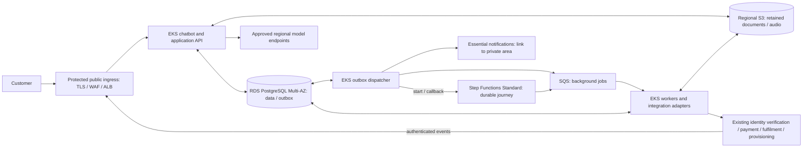

# Meridian Telecom - Solution

## 1. Requirements and constraints

- **Explicit requirements:** a resumable customer journey lasting days or weeks, durable conversations and pending actions, including manual review; no duplicate charges or SIM shipments, and no activation before required checks pass. Chatbot responsiveness must not depend on completion of background work.
- **Explicit reliability and security targets:** 99.9% availability; conversation and durable workflow state RPO < 1 minute and RTO < 10 minutes; confidential customer data stays in the selected region; agent runs and external actions are traceable and auditable.
- **Constraints:** AWS, managed Kubernetes for first production, public internet exposure, two Platform Engineers alongside AI Engineers. Prefer managed services where their benefit justifies lock-in; infrastructure costs must be measurable and sustainable.
- **Workload context:** around 100 launch users, growing toward 100,000 users, thousands of concurrent sessions and hundreds of thousands of daily background tasks. Mostly I/O-bound, with some CPU-heavy processing; company-managed GPUs are optional. Identity verification, payment, fulfilment and provisioning already exist as integrations.

## 2. Assumptions and open questions

### Assumptions

- AWS accounts and provider sandboxes are available; platform infrastructure must be built.
- Recovery targets are assumed to cover pod/node failures, primary database failure and loss of one availability zone in the selected region. Meridian must confirm this scope; logical corruption and regional outages are not demonstrated to meet the targets. Cross-region recovery cannot bypass residency.
- Use a monthly window as the working assumption for 99.9%; Meridian must agree the scope, success criteria and latency thresholds. Measure customer experience end to end, including provider impact.
- Customers may explore offers anonymously but authenticate before accessing a personal journey. This is a product assumption, not an assignment requirement.
- Growth is assumed to be gradual, with temporary bursts. Start with a resilient baseline, not capacity for 100,000 users; size from concurrency, operation frequency and duration. Compliant external model endpoints are assumed available for launch without dedicated GPUs.

### Open questions

These are confirmations and inputs needed to validate the design; the assignment's reliability, correctness and residency targets remain requirements.

- **Recovery scope:** do RPO < 1 minute and RTO < 10 minutes also cover logical corruption and regional outages? Confirm the assumed failure scope and end-to-end recovery acceptance criteria; backup restoration alone has not been shown to meet the targets.
- **Availability:** agree the scope, measurement window, success criteria and latency thresholds for 99.9%, including how provider impact is reported. Confirm operational coverage and escalation compatible with this objective.
- **Regional residency:** which region, provider endpoints and contracts satisfy residency, including inference, logs, backups, support access and subprocessors? A non-compliant dependency blocks launch.
- **External-action correctness:** do providers support stable idempotency keys, sufficiently long deduplication windows, status lookup and authenticated callbacks? Confirm these contracts before relying on safe automated retries of payments or shipments.
- **Manual review and support:** who owns customer exceptions, with what response times, permissions and escalation? Two Platform Engineers do not imply continuous on-call coverage or business-review ownership.
- **Scale and sustainable costs:** what traffic shape, concurrency, job duration, model mix, file volumes, latency targets and budget should drive sizing and cost estimates? Validate capacity and unit costs on representative workloads before expanding.
- **Product and retention choices:** which IdP handles customer/operator authentication, independently of identity verification? Which notification channel/provider and contact preferences apply? Which documents/audio should be retained, for how long, and what audit retention/deletion obligations apply?

## 3. Proposed architecture

### High-level design

The design decisions below were reviewed with the user. Assumptions and external confirmations remain explicit in section 2.

The API commits conversation updates, accepted commands and pending dispatch together before returning a durable reference and pending status. The outbox dispatcher starts the journey or submits an independent job; workflow-owned jobs are submitted by Step Functions, not duplicated by the API. User inputs and authenticated provider events are durably correlated to the waiting journey. The chatbot reads a persisted summary with pending actions and freshness, without rebuilding execution history on every request.

### Main components and responsibilities

- **Step Functions Standard** owns workflow execution, timers, waits and transitions. Only work that gates the journey requires a callback; independent document/audio processing can complete as an ordinary queued job.
- **EKS** runs the application, outbox dispatcher and separately scalable workers. SQS absorbs bursts; it is not the store for weeks-long business waits. Messages carry references rather than confidential payloads where possible.
- **RDS PostgreSQL Multi-AZ** stores conversations, application data, operation identities/results and the queryable journey summary. The summary may lag and must be repairable from execution and operation records. It is not a second workflow engine and cannot authorize an external action on its own.
- **Regional S3** stores retained documents/audio; PostgreSQL holds ownership, metadata and journey references. Authorize short-lived presigned transfers, validate uploads before processing, and pin the validated object version to prevent later replacement. Finalize metadata and any processing command/outbox entry atomically in PostgreSQL; clean abandoned uploads and orphan objects. Keep buckets private, encrypted and regional, with versioning and lifecycle rules covering old versions and deletion obligations. Workflow inputs/history carry minimal references rather than full documents or conversations. S3 avoids inflating database backups; database blobs offer atomic storage, while a shared filesystem is justified only by filesystem-dependent tools. Revisit storage only for such concrete needs. [S3 presigned URLs](https://docs.aws.amazon.com/AmazonS3/latest/userguide/using-presigned-url.html), [S3 versioning](https://docs.aws.amazon.com/AmazonS3/latest/userguide/Versioning.html)
- **Customer updates** combine authenticated status/history with essential notifications for required intervention and agreed milestones. Use the outbox, minimal content and a link to the private area; no document links or sensitive detail in notifications. Recheck whether reminders are still relevant. Chat-only updates miss absent customers; every-transition messages create noise. Delivery failure does not undo journey progress, and provider acceptance does not prove the customer read the message.
- **Existing providers** determine external outcomes; local timeouts cannot establish failure. Reconcile authoritative evidence before advancing.

### Platform vs AI ownership boundary

Platform owns infrastructure, IAM/networking, delivery foundations, recovery tooling, telemetry, capacity and infrastructure cost. AI Engineers own conversational behaviour, workflow definitions, integration/business logic, deterministic action checks, model selection and model cost. Both teams agree operation/idempotency contracts, compatibility and incident handoffs, and validate the first journey end to end. Business ownership of manual review remains unresolved; it must not default silently to Platform.

## 4. Key design decisions and trade-offs

| Decision | Problem and selected option | Credible alternative | Cost / trade-off and revisit trigger |
|---|---|---|---|
| Durable orchestration | Step Functions Standard handles waits and resumptions without keeping a pod alive. | A custom PostgreSQL workflow is initially familiar but adds timers, recovery and tooling to maintain. Temporal is credible where workflow programming requirements justify another platform dependency. | AWS-specific definitions, service quotas, transition charges and application compatibility remain. Revisit if measured cost, workflow expressiveness or portability needs outweigh managed-service benefits; no planned Temporal migration. |
| Separate jobs from orchestration | SQS and EKS workers isolate CPU-heavy/high-volume jobs from interactive requests; callbacks only for journey dependencies. | Execute everything as workflow tasks, or let queue consumers coordinate the entire journey. | Queue redelivery, backpressure and callback recovery add work, but avoid per-job orchestration where unnecessary. Revisit queue boundaries based on contention and priority, not predicted final scale. |
| PostgreSQL plus persisted summary | One transactional application store supports resumption, operation deduplication and efficient status reads; no Redis at launch. | Read workflow history per request, or add a separate cache/read store. | Summary freshness and database capacity need monitoring; Multi-AZ has a minimum cost. Revisit caching only after query/index/connection tuning and measured read pressure. |
| Terraform with S3 remote state | Reproducible changes and shared, locked state support two Platform Engineers. | A managed Terraform execution platform; local state is unsuitable for shared operations. | Platform maintains CI, recovery and provider upgrades. Revisit managed execution if governance or pipeline maintenance warrants it. Ansible only for an actual host-management need. |

Standard supports long-running workflows and callback integrations; its workflow execution semantics do not guarantee exactly-once effects in external systems. Cost comparisons require actual transition and task volumes. [AWS workflow types](https://docs.aws.amazon.com/step-functions/latest/dg/choosing-workflow-type.html)

Use a dedicated regional, private, encrypted S3 state bucket, separate from customer files, with versioning and native `use_lockfile = true`; pin a compatible Terraform version. Separate environment states and permissions, bootstrap the backend independently, and restrict access to Platform/CI temporary roles. Review plans in pull requests and serialize ordinary CI applies per state; locking also protects against concurrent clients. DynamoDB locking is deprecated. Recover old state only after reconciling real resources: restoring state does not roll back infrastructure. Verify a run has ended before clearing a stale lock; monitor console drift. [Terraform S3 backend](https://developer.hashicorp.com/terraform/language/backend/s3)

## 5. Reliability, security and operability

### Reliability

- **Safe actions:** assign stable journey, command and business-operation IDs. Unique constraints and atomic job claims with expiring leases prevent ordinary concurrent execution; a lease alone cannot prevent a stale worker affecting a provider. Reuse the provider idempotency key for the same intended action, persist results, and acknowledge jobs only after durable handling. Redelivery must return the prior result or reconcile pending work. [SQS delivery semantics](https://docs.aws.amazon.com/AWSSimpleQueueService/latest/SQSDeveloperGuide/standard-queues-at-least-once-delivery.html)
- **Uncertain outcomes:** a payment/shipment timeout means unknown, not failed. Use status lookup and authenticated callbacks to reconcile; do not blindly retry with a new key. If provider evidence cannot resolve uncertainty safely, hold the journey for manual resolution. Deduplication retention must cover the actual retry/recovery horizon.
- **Business correctness:** deterministic server-side checks verify identity, payment and the other agreed prerequisites immediately before critical actions. The model cannot authorize activation. Duplicate, late and out-of-order events must not regress confirmed state or bypass checks; corrected details do not silently repeat an already submitted action.
- **Dependency failures:** bounded timeouts, backoff with jitter, retry budgets and circuit breakers prevent retry storms. Respect provider quotas; use queue concurrency limits, dead-letter queues and reviewed replay. Show truthful pending status while affected work pauses.
- **Callback recovery:** commit the result and pending callback together before acknowledging SQS; the same dispatcher delivers it. Retry notification, not the completed action. Keep operation identity stable and execution/attempt/token distinct. An invalid token alone does not prove delivery: reconcile execution state; a new waiting attempt can receive the saved result through its new token only if it still refers to that operation. Closed or diverted journeys are not forced forward. Protect tokens and set bounded waits. [AWS callback pattern](https://docs.aws.amazon.com/step-functions/latest/dg/connect-to-resource.html)
- **Transactional outbox — agreed:** atomically record each accepted command and pending dispatch. A separate EKS Deployment starts with two lightweight polling replicas: acquire due batches atomically with row locks/`SKIP LOCKED`, record an expiring lease, commit, then call AWS outside the transaction. Updates verify lease ownership; expired claims are recoverable. Stable IDs, immutable dispatch input and reconciliation handle ambiguous sends. Use bounded retries/backoff, retain blocked sends for intervention and monitor oldest pending age. Polling adds DB reads and dispatch latency; prefer it over CDC at launch, revisiting on measured load/latency. It delivers work, not business transitions. [AWS outbox](https://docs.aws.amazon.com/prescriptive-guidance/latest/cloud-design-patterns/transactional-outbox.html), [PostgreSQL locking](https://www.postgresql.org/docs/current/sql-select.html)
- **Workflow versioning — agreed:** persist the exact workflow version in the outbox. Apply additive schema changes, deploy workers supporting old and new job contracts, then enable the new workflow for new journeys. Retain compatibility through pending jobs, old journeys and the agreed replay horizon; separate worker versions only for unavoidable incompatibility. Drain on shutdown and recover interrupted work. Routing new starts back does not undo executions already started on the new version; rollback must still support them. [AWS workflow versions](https://docs.aws.amazon.com/step-functions/latest/dg/concepts-state-machine-version.html)
- **Recovery:** distribute replicas and capacity across zones, use RDS Multi-AZ, automatic client reconnection and controlled deployments. Measure state loss and time until conversations/status and pending work are usable again, including workflow/DB reconciliation, against RPO < 1 minute and RTO < 10 minutes. Multi-AZ costs more than Single-AZ but avoids relying on restore for ordinary failures. Keep regional backups and rehearse restores separately; PITR alone does not establish these targets. Logical corruption and regional outages remain outside the demonstrated scope, subject to Meridian confirmation. [RDS failover](https://docs.aws.amazon.com/AmazonRDS/latest/UserGuide/Concepts.MultiAZ.Failover.html), [RDS restore](https://docs.aws.amazon.com/AmazonRDS/latest/UserGuide/USER_PIT.html)

For Standard workflow starts, reuse the command-derived execution name and identical input. `StartExecution` is idempotent for matching running executions; a closed execution returns `ExecutionAlreadyExists` and requires reconciliation, not a new name. Name protection is time-limited, so old replays also require application records. SQS sends and deliveries may duplicate: consumers must deduplicate operations. See [StartExecution semantics](https://docs.aws.amazon.com/step-functions/latest/apireference/API_StartExecution.html) and the detailed scenarios in [questions.md](questions.md).

### Security

Seven agreed principles apply from launch:

1. **Customer isolation:** enforce authenticated customer ownership on every conversation, journey, file and action; never trust an ID or model-provided customer identity as authorization. Carry verified ownership into asynchronous work. Shared services with centralized application authorization are the launch default; database-per-customer is disproportionate. RLS is an optional additional defence, not a substitute for API/file/action checks; revisit if query-access risks justify its role and connection-context complexity.
2. **Identity Provider:** delegate authentication to the selected IdP; require appropriate operator roles and strong authentication. Authenticate and deduplicate provider events independently.
3. **Workload identity:** give each workload narrowly scoped AWS permissions through workload roles, without shared static credentials. Separate application, worker, dispatcher, deployment and operator rights; EKS Pod Identity is a suitable mechanism.
4. **Secrets store:** use a managed regional secrets store, rotation and restricted access. Encrypt traffic and stored data, including backups; redact secrets, tokens and personal content from telemetry.
5. **Protected ingress:** TLS, WAF, request limits, validation and per-customer throttling protect public endpoints. Bound uploads and model/tool usage to control abuse and spend.
6. **Deterministic critical-action controls:** validate tool arguments, eligibility, authorization and required customer confirmation outside the model. Treat prompts, uploads and provider content as untrusted; preserve evidence of approvals.
7. **Private networking:** keep database and worker nodes private, restrict east-west traffic and control outbound destinations. Apply regional residency to storage, inference, telemetry, workflow payloads and external integrations. No fallback to unapproved destinations, even during an outage.

### Operability and observability

Use a managed regional telemetry backend (for example CloudWatch and AWS tracing), structured redacted logs, metrics and OpenTelemetry instrumentation. This reduces maintenance compared with a self-hosted stack; monitor ingestion/retention costs and revisit if cost or query needs justify another backend. Correlate short traces with journey, operation, execution and attempt IDs; link traces across waits instead of keeping one open for weeks. [OpenTelemetry traces](https://opentelemetry.io/docs/concepts/signals/traces/)

Keep a separate, unsampled durable application audit in PostgreSQL: agent runs, model/version, action requests, authorization, provider references, outcomes and operator interventions. Record local audit events with the corresponding transaction and external intentions/outcomes around provider calls, reconciling crash gaps. Ordinary application roles cannot update/delete audit records. Retention, controlled deletion and any immutable archive requirement remain open; this is not a claim of tamper-proof storage.

Measure 99.9% end to end over the proposed monthly window, with agreed success/latency criteria for chat, durable acceptance and status access. A `200` alone is insufficient. Report provider impact and asynchronous progress separately without hiding stalled processing behind a healthy chat endpoint; a legitimate business wait is not itself downtime.

Dashboards cover latency/errors, blocked journey age, unknown external outcomes, queue age/dead letters, outbox/callback backlog, provider throttling, DB saturation and costs. Alerts need an owner and actionable runbook. An authenticated operator view shows reason, evidence, next action and assigned reviewer; interventions use authorized application actions and audit, not routine direct DB edits. Platform handles infrastructure, AI workflow/integration defects, business reviewers customer exceptions. Coverage, escalation and response times must support the SLO; two engineers do not imply continuous on-call.

## 6. Scaling and cost

### Launch

Use a small EKS footprint with replicated interactive services, separately bounded workers, RDS Multi-AZ, SQS and Step Functions. This has a non-trivial minimum cost for 100 users, justified by the Kubernetes constraint and reliability target. Keep chatbot calls I/O-oriented, persist each turn and offload heavy processing. Agree latency objectives, limit external concurrency and return pending status when dependencies are slow.

### Growth

Use separate HPAs: active requests per chatbot replica and SQS backlog per worker, calibrated against job duration and desired drain time; CPU where representative. Queue age remains an alert/progress signal. External state enables interchangeable replicas; idempotency still governs concurrency. Keep minimum interactive replicas across zones and conservative scale-down. Bound maximum replicas, aggregate provider calls and DB connections. Keep dispatcher replicas fixed initially. Expose external/custom metrics through an adapter or KEDA integration selected during implementation; EKS does not supply them automatically. VPA recommendations are optional for sizing, not a launch dependency. [Kubernetes HPA](https://kubernetes.io/docs/concepts/workloads/autoscaling/horizontal-pod-autoscale/)

Use Managed Node Groups with Cluster Autoscaler for node capacity. HPA alone leaves pods pending when nodes are full. Retain baseline headroom for interactive traffic and bounded node growth; queues absorb background provisioning delay. Karpenter offers more flexible provisioning but adds controller ownership; Auto Mode reduces operations with added fees/constraints and is not selected. Revisit if workload diversity or operating effort warrants it. [AWS Cluster Autoscaler](https://docs.aws.amazon.com/eks/latest/best-practices/cas.html), [AWS Auto Mode](https://docs.aws.amazon.com/eks/latest/best-practices/automode.html)

Share nodes initially with measured resource requests/limits and bounded worker concurrency. When CPU jobs interfere with chat or require a different machine profile, add a compute-optimized group. A `NoSchedule` taint reserves it, worker tolerations permit entry, and labels plus required node affinity direct workers there. Tolerations alone do not select nodes. Isolation can leave spare capacity unused; extra cores only accelerate a single job if its implementation uses them. [Kubernetes scheduling](https://kubernetes.io/docs/concepts/scheduling-eviction/taint-and-toleration/)

Load-test progressively toward thousands of concurrent sessions and hundreds of thousands of daily jobs using duration and burst profiles, not user count alone. Tune queries/indexes before caches/replicas and raise quotas before reaching limits. This preserves the architecture without pre-provisioning final-scale capacity.

### Deferred complexity

Defer Redis, GPUs and Temporal until measurements or concrete requirements justify them. For GPUs, use a dedicated node group with taints/tolerations, required affinity, explicit GPU resources and compatible drivers/device plugin. Scale inference replicas on relevant demand and nodes on capacity needs; model loading and node startup may require warm capacity for interactive use. Self-hosting is not automatically cheaper. AI owns model suitability/quality and routing; Platform owns serving infrastructure, isolation, capacity and observability. [Kubernetes GPU scheduling](https://kubernetes.io/docs/tasks/manage-gpus/scheduling-gpus/)

Any model router must enforce approved regional destinations, quotas and cost limits. Confidentiality is required at launch; fail closed or degrade safely if no compliant endpoint is available. A hybrid provider/GPU setup is justified only by a specific model or measured need.

### Main cost drivers

Separate the minimum platform floor (EKS, baseline nodes, Multi-AZ database, ingress/networking and telemetry) from variable worker compute, storage/retention, workflow transitions, queue requests, logs and network traffic. Track model tokens/calls and any GPU utilization separately. Platform owns infrastructure spend; AI owns model usage/cost; a shared view reports cost per completed journey and the effects of retries, abandonment and failed integrations. Use environment/component attribution, tags, budget alerts, retention limits and workload measurements; budget alerts do not replace concurrency controls. No numeric forecast or assertion that one engine is cheaper is defensible until region, usage and model assumptions are known.

## 7. Delivery and validation

### Development and validation approach

Use reviewed Terraform and application/workflow changes, isolated sandbox validation, CI checks, provider contract tests and controlled promotion with rollback. Platform and AI validate the first end-to-end journey together, then inject failure at persistence, dispatch and provider boundaries. Use synthetic customer data; no cloud deployment or paid model experiment is part of this take-home.

| Scenario to validate before launch | Required evidence |
|---|---|
| Disconnect/restart and days-long waits | Conversation, pending input and journey resume without starting again; accelerated timer tests plus representative soak tests. |
| Duplicate delivery and concurrent claims | Repeated requests, expired leases and worker crashes do not create duplicate charges or shipments; reconcile against sandbox provider records. |
| Premature activation | Missing, failed, stale or reordered prerequisite events cannot authorize activation. |
| Lost callback and uncertain payment | Crash after provider success and before local persistence/callback; reconcile the effect and recover notification without repeating it. |
| Deployment | An old waiting journey resumes across worker/schema/workflow updates and rollback. |
| Provider outage/throttling | Bounded retries, backpressure, truthful status, controlled recovery and manual escalation. |
| Availability and recovery | Inject pod/node/AZ/database failover; measure customer-visible outage, state loss and time to resume against the agreed SLO, RPO and RTO. Rehearse restore separately. |
| Load and cost | Representative interactive/background mix establishes latency, bottlenecks, queue drain time and sustainable unit cost within provider limits. |
| Isolation, residency and audit | Cross-customer and unauthorized-operator access is denied; validate secret rotation and redaction, inspect endpoints/egress and storage/telemetry regions, and reconstruct actions even with sampled traces. |
| Durable acceptance | Two pollers, expired claims and crashes before/after remote acceptance: acknowledged commands remain recoverable without duplicate logical operations. |
| Uploads and notifications | Interrupted/invalid uploads, replacement after validation, orphan cleanup and retention including old versions; absent customers, duplicate/failed notifications and obsolete reminders. |
| Terraform operations | Concurrent runs respect locking, environment access is isolated, state recovery is reconciled with real resources in sandbox. |
| Scaling and operational handoff | Mixed chat/CPU bursts, unavailable metrics, node provisioning/drain and provider saturation respect limits; verify placement, alert ownership, escalation and cost attribution. |

These are planned tests, not reported results. Unmet correctness, residency or recovery targets are explicit launch blockers, not assumed properties of AWS.

### Phase 1 - Launch

**Indicative estimate: 6–8 weeks**, conditional on accounts, provider sandboxes/contracts and parallel AI-team delivery. It is not a commitment from two Platform Engineers in isolation.

- **Weeks 1–2 — foundations:** confirm region, SLO/recovery scope, provider guarantees and ownership; establish Terraform, networking, EKS, database, identity/secrets, CI, baseline observability and security. Establish the agreed outbox and version-compatibility contracts with AI Engineers.
- **Weeks 3–5 — integration:** deliver the first durable journey with AI Engineers, then integrate queues, provider reconciliation, resume/status, essential notifications and manual-review handoff. Start joint end-to-end and fault tests immediately.
- **Weeks 6–8 — launch readiness:** complete recovery, compatibility, isolation, audit and representative load tests; tune capacity/cost, rehearse runbooks and agree operational coverage. Missing provider capabilities or failed recovery tests extend the timeline or require an explicit scope decision.

### Phase 2 - Stabilize and measure

During the first weeks after launch, review incidents, stale journeys, latency and unit costs jointly. Tune alerts, retry limits, queries and operator procedures using production evidence; timing depends on representative traffic and ownership being available.

### Phase 3 - Scale when justified by evidence

At measured saturation, sustained backlog or forecast demand, expand capacity and request quotas before limits are reached. Introduce caching, GPU serving or a different workflow engine only with a specific bottleneck, validation and ownership case. No fixed calendar milestone or final-scale capacity is assumed.

## 8. AI usage

### Tools / models used

I used Codex for design consolidation, trade-off analysis and Markdown drafting. A previous agent supplied the initial consolidation plan; exact model identifiers were not verified. Official AWS, Kubernetes, PostgreSQL, HashiCorp and OpenTelemetry documentation was checked during the discussion.

### What I delegated

I delegated requirements review, comparison of alternatives, presentation drafting and the five failure-scenario answers. The work produced documentation, not a running implementation. No cloud deployment, provider experiment or paid cloud test was performed.

### Suggestions I accepted or changed

I reviewed the proposal point by point and approved transactional outbox with a polling dispatcher, callback recovery, workflow versioning and compatible workers; Multi-AZ with explicit recovery assumptions; essential notifications; S3 documents and separate Terraform state; HPA and Managed Node Groups with Cluster Autoscaler; security, managed observability and durable audit. I chose a resilient baseline sized for gradual growth rather than initial final-scale capacity.

I did not select Auto Mode for this proposal. Dedicated CPU groups are conditional; GPUs, Redis, Temporal, RLS and VPA remain optional or deferred. Exact budgets, provider guarantees and operational coverage remain unresolved rather than inferred.

### How I reviewed and validated the work

I reviewed and approved each design topic in conversation, then approved consolidation. Documentary validation checks assignment coverage, consistency across the three files, eight solution sections, five discussion questions, presentation timing and change scope. These checks do not establish runtime correctness: the operational tests in section 7 are future launch criteria. No external exactly-once guarantee or automatic achievement of RPO/RTO is claimed.
