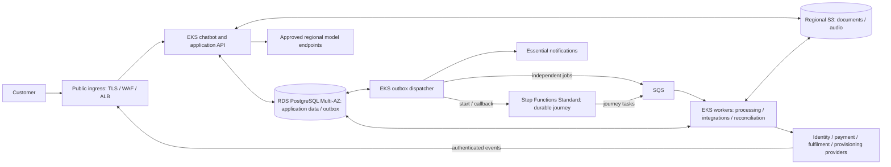
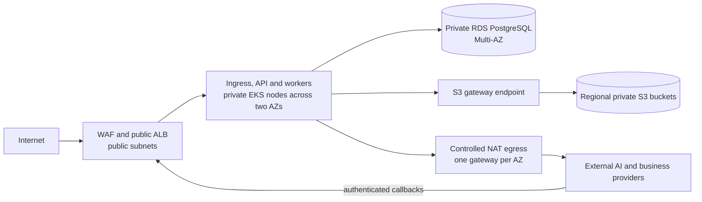

# Meridian Telecom - Solution

## 1. Design drivers and assumptions

### Requirements and constraints

- **Customer journey:** conversations and progress survive disconnections, restarts and deployments, including waits lasting weeks and manual review. Customers receive timely responses and updates; retries must not cause duplicate charges or shipments, or activation before required checks pass.
- **Reliability and security:** 99.9% availability; conversation and durable workflow state RPO < 1 minute and RTO < 10 minutes; confidential data remains in the selected region; agent runs and external actions are auditable.
- **Platform:** AWS and managed Kubernetes, operated by two Platform Engineers alongside AI Engineers. Use managed services where their operational benefit justifies lock-in; make infrastructure costs measurable.
- **Scale:** approximately 100 launch users, with a path to 100,000 users, thousands of concurrent sessions and hundreds of thousands of daily background tasks. Mostly I/O-bound work, some CPU-heavy processing, optional company-managed GPUs and existing external integrations.

### Working assumptions and confirmations

| Topic | Working position | Confirmation needed |
|---|---|---|
| Recovery and availability | Design for pod/node, primary database and single-AZ failures; measure availability monthly. | Agree success/latency criteria and failure scope. Logical corruption and regional outages are not demonstrated to meet the recovery targets. |
| Residency and providers | Launch with approved regional model endpoints and no dedicated GPUs. | Select region and confirm residency across integrations, inference, telemetry, backups and provider access. Verify idempotency and its retention window, status lookup, callback authentication and correlation contracts. |
| Product and operations | Authenticate before accessing a personal journey; use essential notifications and manual exception handling. | Select IdP and notification channel; agree retention/deletion, reviewer ownership, response times and on-call coverage. |
| Delivery and capacity | Accounts and sandboxes are available; growth is gradual with bursts; AI development proceeds alongside Platform. | Confirm team availability, traffic shape, job duration, model mix, latency expectations and budget. |

These assumptions do not relax the requirements. Missing provider guarantees can prevent safe automation; unresolved residency or recovery requirements block launch.

## 2. Architecture and key decisions



### Network view



The launch VPC spans two Availability Zones. Only the ALB and NAT gateways use public subnets; EKS nodes and RDS have no public addresses. Security groups restrict the ALB-to-application and application-to-database paths. An S3 gateway endpoint keeps object traffic off the NAT path without an hourly endpoint charge. NAT provides zonal outbound connectivity rather than destination filtering, so workload identity, application allow-lists and provider controls remain necessary. Each AZ uses its local NAT path so the loss of one AZ does not remove provider connectivity. [S3 gateway endpoints](https://docs.aws.amazon.com/vpc/latest/privatelink/gateway-endpoints.html), [NAT gateway pricing and topology](https://docs.aws.amazon.com/vpc/latest/userguide/nat-gateway-pricing.html)

### Components and responsibilities

The API persists conversation turns and accepted commands before confirming receipt. A transactional outbox records pending dispatch with the corresponding application change. A small replicated polling dispatcher delivers starts, callbacks, independent jobs and notifications. This adds delivery latency and recovery logic, but prevents accepted work being lost between a database commit and a remote call. [Transactional outbox](https://docs.aws.amazon.com/prescriptive-guidance/latest/cloud-design-patterns/transactional-outbox.html)

Step Functions submits journey tasks to SQS; the API does not also submit those tasks. Workers handle integrations and CPU-heavy processing independently of interactive traffic. Business waits live in the workflow, without occupying a worker or leaving a queue message unacknowledged for days. Only tasks that gate progress need workflow callbacks. [Callback integrations](https://docs.aws.amazon.com/step-functions/latest/dg/connect-to-resource.html)

The chatbot reads persisted status and pending actions. Distinguish a received message from a completed model response, and recover interrupted turns. Status access remains available without inference; a pending acknowledgement does not count as a completed conversational answer. Notify absent customers of required action and agreed milestones through minimal messages linking to the private area.

S3 holds retained documents/audio; PostgreSQL holds ownership and metadata. Use private encrypted storage, authorized short-lived transfers, upload validation and a fixed validated object version. Apply retention and cleanup to abandoned uploads and old versions. Queues and workflow payloads carry references rather than customer content.

### Four choices to defend

| Choice | Why this option | Alternative and trade-off | Revisit when |
|---|---|---|---|
| Step Functions Standard | Managed durable waits, timers and resumptions. | A PostgreSQL workflow adds recovery/timer tooling to maintain; Temporal is credible for stronger workflow programming needs. Step Functions adds AWS-specific definitions and transition costs. | Expressiveness, portability or measured costs outweigh the managed-service benefit. |
| PostgreSQL with outbox and status summary | One transactional application store supports resumption, operation records and efficient reads. | Reading execution history per request couples customer access to orchestration APIs; another read store adds synchronization. The summary can lag and needs repair. | Query/index/connection tuning no longer resolves measured database pressure. |
| SQS and EKS workers | Buffer bursts and scale background work separately from chat. | Doing work inside requests ties responsiveness to provider latency; orchestration for every independent job adds unnecessary coordination. Queues require duplicate handling and backpressure. | Measured contention or priority differences justify separating worker pools or queues. |
| Managed services and resilient baseline | EKS, RDS Multi-AZ and managed telemetry reduce operations for a small team. | Self-hosting offers control but adds maintenance; Single-AZ lowers cost but weakens the recovery approach. The chosen baseline has a material minimum cost and AWS dependency. | Measured economics or operational requirements justify a different arrangement. |

Standard workflow execution does not by itself guarantee exactly-once effects at a payment or shipment provider. Application and provider contracts remain necessary. [Workflow types](https://docs.aws.amazon.com/step-functions/latest/dg/choosing-workflow-type.html)

### Three application contracts

1. **State ownership:** Step Functions owns execution position, waits and transitions. PostgreSQL owns conversations, business facts and operation records; providers supply authoritative evidence of external effects. The summary is a derived view, never authorization for an action. Persist enough business history to reconstruct customer status independently of workflow-history retention; use execution state to reconcile orchestration progress.
2. **Operation identity:** repeated requests for the same purchase reuse the same intended payment or shipment, even across sessions. Atomically check prerequisites and authorize an operation with fixed input/version before external submission. Changes after submission require an explicit correction or assistance path. Deterministic application checks enforce eligibility and customer confirmation; neither the model nor a duplicate message can authorize activation.
3. **Recovery:** durably capture and deduplicate incoming events before acknowledging them, including events arriving before their wait registration. Reconciliation matches evidence to operations and eligible waits, repairs summaries and schedules callbacks; late or duplicate events cannot regress confirmed progress. An unknown outcome remains pending until resolved; unresolved uncertainty goes to manual review, without a new charge or shipment.

Platform owns infrastructure, IAM/networking, delivery, recovery tooling, telemetry, capacity and infrastructure spend. AI Engineers own conversation, workflow and integration logic, including reconciliation running in the existing workers; Platform provides its scheduled execution and monitoring. Both agree operation contracts, compatibility and incident handoffs. Business reviewers own customer exceptions; that role must be assigned before launch.

## 3. Worked example: a payment survives a crash

This illustrative purchase journey assumes identity verification has passed. The payment provider supports stable idempotency keys, authoritative lookup and authenticated events carrying our operation reference. These capabilities must be confirmed; this is a design walkthrough, not a test result.

| Event | Responsible component and durable handling | Customer-visible result |
|---|---|---|
| 1. Customer confirms the purchase. | API saves confirmation, the purchase/payment identity and pending workflow start together. A repeated confirmation resolves to the same purchase. | Request accepted, processing pending. |
| 2. Payment is dispatched. | Dispatcher starts the pinned workflow version using a stable execution identity. Step Functions queues the task and waits. Worker checks prerequisites and persists the authorized payment intent and fixed input before calling the provider with its stable key. | Payment processing. |
| 3. Provider charges successfully; worker crashes. | The crash occurs before the worker saves the result and completes local wait registration. The operation intent survives; the queue task remains recoverable. Local state cannot yet claim success or failure. | Payment confirmation pending, not a request to pay again. |
| 4. Webhook arrives before local recovery. | API authenticates and durably stores the event against the operation reference before acknowledging it. The event survives even though its workflow wait association is incomplete. | Existing pending status remains safe until the evidence is applied. |
| 5. Customer returns in another session. | API reads the same conversation, purchase and persisted status. Repeated confirmation does not create another payment operation. | The journey resumes; the customer sees current pending actions and status freshness. |
| 6. Recovery joins the evidence and the wait. | Redelivery lets the worker restore the task association and reconcile the stored event or provider lookup, without a new payment. It commits the confirmed outcome, summary and pending callback together before acknowledging the queue task. | Payment confirmed; fulfilment pending. |
| 7. The workflow continues. | Dispatcher delivers the callback. If delivery is uncertain, reconcile execution state and retry the callback, not payment. Use only an eligible wait for the same operation. Fulfilment uses its own stable operation identity; delivery and provisioning outcomes are persisted and activation checks remain enforced. | Milestone updates through delivery and activation; required actions remain accessible on return. |

A task token identifies a particular wait attempt, not the commercial operation. An expired token cannot establish whether progress occurred; a closed or diverted journey must not be forced forward. If evidence cannot resolve payment safely, suspend for an authorized reviewer. If a later step fails after a charge or shipment, handle any refund or cancellation manually at launch, record the outcome and communicate it. This avoids building a generic compensation engine, at the cost of reviewer effort and slower exceptional resolution.

## 4. Reliability, security and operation

### Reliability and recovery

Retries have separate responsibilities: the dispatcher retries delivery, workers make bounded transient call retries, and workflows control business waits and escalation. Reconcile ambiguous starts against the original execution before starting anything new. Preserve operation identity throughout, reconcile uncertain effects, and retain deduplication records through the recovery horizon. Backoff, provider-wide concurrency limits and reviewed dead-letter replay prevent retry storms. Reserve dispatch capacity for critical callbacks so notification failures cannot block progress.

Distribute application replicas and node capacity across zones, use RDS Multi-AZ and automatic client reconnection. Keep enough existing capacity in the surviving zones for chat and status at the agreed baseline load; background throughput may temporarily fall while nodes recover. Validate outbound provider connectivity under AZ loss as well as compute placement. This headroom costs more than relying entirely on replacement nodes. [RDS failover](https://docs.aws.amazon.com/AmazonRDS/latest/UserGuide/Concepts.MultiAZ.Failover.html)

Measure state loss and time until conversations, status and pending work are usable against RPO < 1 minute and RTO < 10 minutes. Regional backups and restore drills address separate recovery needs; Multi-AZ and backups alone do not prove these targets. Logical corruption and regional outages remain outside the assumed scope, pending confirmation; recovery cannot bypass residency.

Pin workflow versions for accepted starts. Deploy additive schemas and compatible workers before enabling new workflows; maintain compatibility for open journeys and pending replays. Rolling back new starts does not undo executions already running the new version.

### Security and audit

- **Access:** selected IdP for customer/operator authentication, strong operator authentication and explicit roles. Enforce ownership on every conversation, file and action, including asynchronous work. Authenticate provider events independently.
- **Exposure and secrets:** TLS, WAF, request/upload limits and customer throttling; private database and worker nodes, restricted internal traffic and controlled egress. Use scoped workload roles and a regional secrets store, with rotation and encryption.
- **AI and residency:** treat prompts, uploads and external content as untrusted. Validate tool arguments and approvals outside the model. Bound model/tool usage and permit only approved regional destinations, including telemetry and backups; degrade safely if none is available.
- **Audit:** retain unsampled application records of agent runs/model versions, approvals, operation intentions, provider outcomes and operator interventions. Write local audit with the related transaction, reconcile external-call gaps and prevent ordinary application roles from modifying audit history. Redact personal content and tokens from telemetry; retention/deletion and any immutable archive obligation require agreement.

### Daily operation

Use regional managed telemetry with structured logs, metrics and OpenTelemetry tracing. Correlate journey and operation IDs across short traces; retain audit independently of trace sampling. Managed telemetry reduces maintenance but requires ingestion and retention controls.

Measure availability through customer-visible chat, durable acceptance and status access, with agreed latency/success criteria and explicit provider impact. Track asynchronous progress separately: legitimate business waits are not downtime, but stalled processing must remain visible. Monitor latency/errors, unknown outcomes, queue/outbox age, provider throttling, database pressure and cost.

An authenticated operator view exposes evidence, pending action and assigned reviewer. Interventions use audited application actions. Platform handles infrastructure incidents, AI Engineers workflow/integration defects, and business reviewers customer exceptions. Alerts require actionable runbooks and escalation; two Platform Engineers do not imply continuous coverage.

## 5. Growth and cost

Start with a small resilient EKS footprint, bounded workers, RDS Multi-AZ and the managed queue/orchestrator. Share nodes initially with resource requests/limits that protect chat from CPU-heavy work. Keep the dispatcher small and replicated; avoid Redis and dedicated GPUs at launch.

As demand grows, scale chat on active requests and workers on backlog relative to job duration and desired drain time. HPA needs a metrics adapter or KEDA for these signals. Managed Node Groups with Cluster Autoscaler supply node capacity; queues absorb background provisioning delays. Bound replicas, database connections and aggregate provider traffic: more workers cannot overcome a provider quota. Isolate CPU workloads when measured contention justifies extra capacity. Retain interactive headroom and conservative scale-down.

Validate progressively toward the stated concurrency and task volumes using representative durations and bursts; user count alone is insufficient. Tune database access before adding caches, and request quotas before reaching limits. Consider GPU serving only for a required model or measured benefit, including utilization, startup and operating cost. AI owns model suitability, routing and usage costs; Platform owns serving infrastructure and capacity. Revisit orchestration only for demonstrated limitations.

Separate the **fixed baseline** (EKS, nodes, Multi-AZ database, ingress/networking and telemetry) from **variable usage** (compute, storage, transitions, queue requests, logs and traffic). Track model consumption separately and jointly report cost per completed journey, including retries and abandonment. Use environment/component attribution, budget alerts and enforceable usage/concurrency limits.

**Indicative launch baseline: approximately €700–1,200 per month** for one production environment, excluding model and external-provider charges. This is a budgeting range rather than an AWS quote. It assumes eu-west-1, 730 hours per month, on-demand pricing without credits or commitments, a planning conversion of USD 1 ≈ EUR 1, modest launch traffic and no paid AWS support or tax.

| Cost area | Launch assumption | Indicative monthly range |
|---|---|---:|
| EKS control plane | One cluster on a Kubernetes version in standard support. | €70–90 |
| EKS nodes and disks | Two general-purpose nodes, each approximately 2 vCPU / 8 GiB, spread across two AZs, with small encrypted EBS volumes. Capacity must still be load-tested. | €160–250 |
| RDS PostgreSQL | Multi-AZ deployment with one standby, approximately `db.m6g.large`, 50 GiB general-purpose storage and backups within the included allowance. | €250–400 |
| Ingress and networking | One ALB, basic WAF rules, two zonal NAT gateways, public IPv4 addresses and modest processed data. | €120–180 |
| Telemetry | Regional managed metrics/traces and approximately 10–30 GB of logs per month, 30-day operational retention and sampled tracing. | €30–100 |
| Step Functions Standard | Illustrative 10,000–100,000 state transitions per month; free-tier eligibility is not assumed. | €0–5 |
| Other managed services | Low launch usage of S3, SQS, ECR, secrets, encryption keys and backup storage. | €30–75 |

The row totals are approximately €660–1,100; the headline range rounds upward to allow for data transfer, request charges and estimation error. EKS and RDS create most of the minimum spend; Step Functions is immaterial at launch under the stated transition assumption. Actual pricing must be recalculated in the selected region before budget approval. [EKS pricing](https://aws.amazon.com/eks/pricing/), [RDS for PostgreSQL pricing](https://aws.amazon.com/rds/postgresql/pricing/), [Elastic Load Balancing pricing](https://aws.amazon.com/elasticloadbalancing/pricing/), [AWS WAF pricing](https://aws.amazon.com/waf/pricing/), [CloudWatch pricing](https://aws.amazon.com/cloudwatch/pricing/), [Step Functions pricing](https://aws.amazon.com/step-functions/pricing/)

Variable cost depends on completed and abandoned journeys, steps and retries per journey, model calls and tokens, document/audio processing, retained data and telemetry, and outbound traffic. Track both infrastructure cost per completed journey and model-provider cost per journey: user count alone does not predict either. Replace these assumptions with measured workload scenarios before committing budget. A cheaper baseline must still be assessed against recovery capacity and operator effort.

## 6. Delivery, validation and AI usage

### Development and delivery

Use reviewed Terraform with protected, encrypted and locked remote state in a separate regional S3 bucket, plus isolated environment access. CI validates infrastructure, application and workflow changes; promote through sandbox tests with synthetic data and controlled rollout/rollback. Platform and AI build one complete journey early and test failures at persistence and provider boundaries.

**Indicative launch estimate: 6–8 weeks for an agreed first-release scope**, conditional on accounts, provider sandboxes/contracts and parallel AI-team delivery:

- **Weeks 1–2:** confirm region, recovery scope, provider guarantees and operational ownership; establish infrastructure, identity/secrets, CI and baseline telemetry.
- **Weeks 3–5:** integrate the first durable journey, reconciliation, resume/status, notifications and operator handoff; begin joint failure tests immediately.
- **Weeks 6–8:** complete readiness checks, tune capacity/cost and rehearse recovery and escalation. Provider limitations, missing product capabilities or failed recovery tests extend the timeline.

After launch, stabilize using incidents, stale journeys, latency and unit costs. Expand capacity from measured pressure and forecast demand; defer additional services until their benefit and ownership are clear.

### Validation priorities

| Area | Evidence required before launch |
|---|---|
| Journey continuity | Disconnects, restarts and long waits preserve conversation and pending actions; interrupted responses recover and absent customers receive essential updates. |
| Safe external actions | Exercise the worked example, concurrent confirmations, duplicate/early/late events, lost callbacks and provider outages. Provider records show no duplicate charge/shipment; unmet prerequisites prevent activation; unresolved cases reach review. |
| Deployment compatibility | An old waiting journey resumes across workflow, worker and schema updates, including rollback. |
| Recovery | Inject pod/node/AZ/database failures and measure customer-visible recovery and state loss against the targets. Rehearse backup restore separately. |
| Security and sustainable load | Demonstrate customer/operator isolation, upload controls, regional data paths, secret protection and auditable actions. Mixed chat/CPU load respects latency, provider limits, capacity and cost expectations; verify alert ownership. |

These are planned tests, not results. Correctness, residency and recovery failures block launch.

### AI usage

Codex with **GPT-5.6 Terra** and **GPT-6 Astra** assisted planning, requirements review, comparison of design alternatives, Markdown drafting and failure-scenario preparation. AI work included critical review and consolidation; it did not include a deployment or production validation. Official AWS, Kubernetes, PostgreSQL, HashiCorp and OpenTelemetry documentation informed the discussion.

The repository separates instructions, source requirements and the evolving answer so AI suggestions cannot silently become assignment requirements:

```text
AGENTS.md      AI working rules: scope, review criteria and required distinctions
assignment.md  Authoritative take-home requirements; not edited during preparation
solution.md    Working proposal: assumptions, decisions, trade-offs and validation gaps
```

This structure made the review path explicit: re-read the assignment, challenge the current proposal under `AGENTS.md`, then edit only the working solution. It also preserves enough factual notes to explain what was delegated and how the output was checked without requiring a complete chat transcript.

I reviewed the design choices and accepted outbox delivery, managed orchestration, explicit recovery assumptions and a resilient launch baseline. I requested a critical review and approved simplifying the document around state ownership, operation identity, reconciliation and one worked example. Auto Mode was not selected; GPUs, Redis and alternative orchestration remain deferred. Detailed SQL, locking and scheduling procedures were removed from the main proposal.

Validation of this revision is documentary: assignment coverage, internal consistency, example/architecture alignment and reduced length. Runtime tests remain future launch criteria. No cloud deployment, provider experiment or paid cloud test was performed. The example illustrates the design; it does not demonstrate production guarantees.
